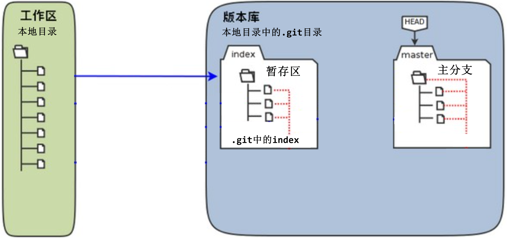
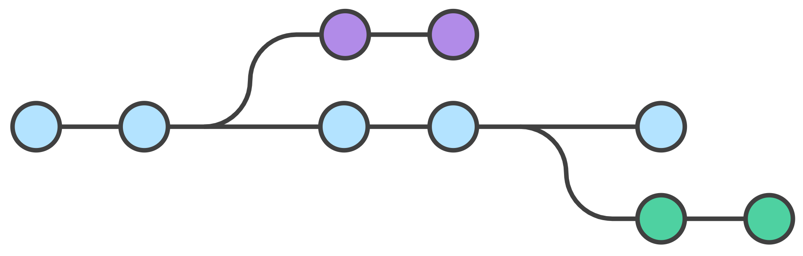
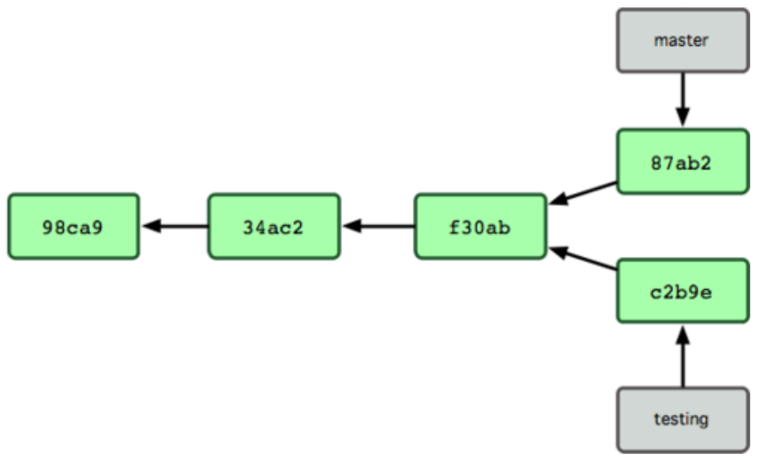
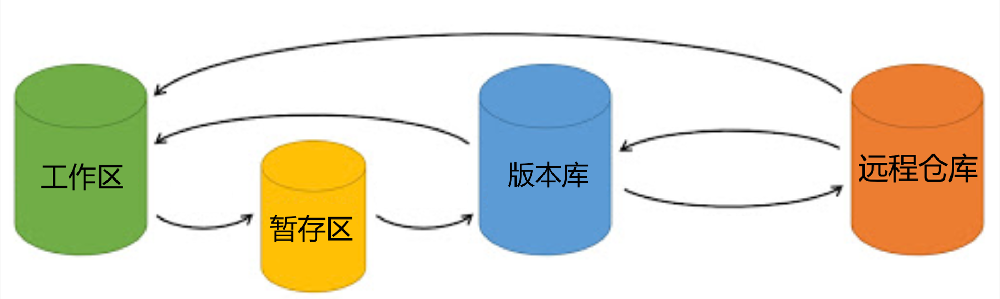
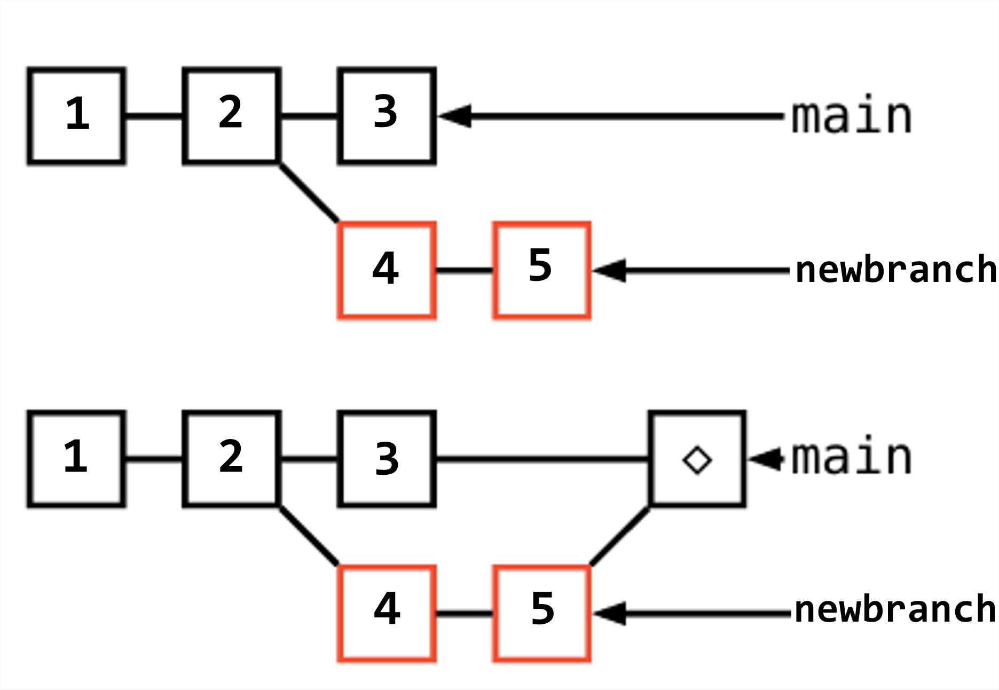
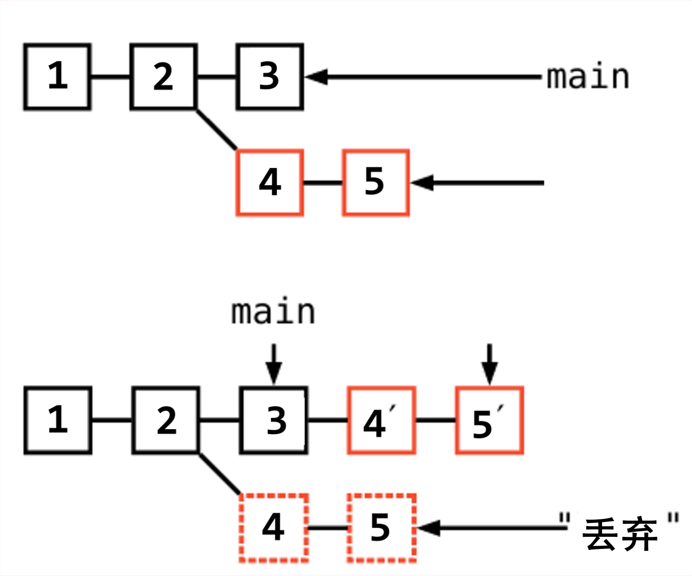
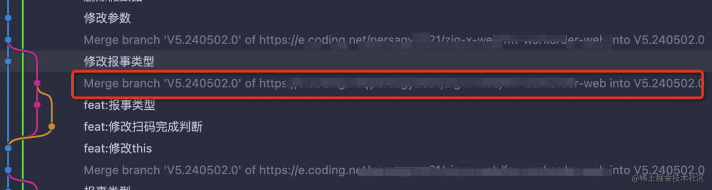
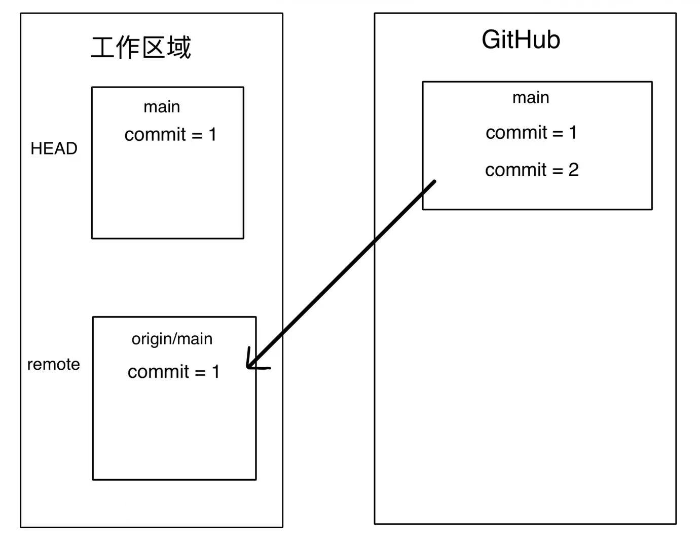
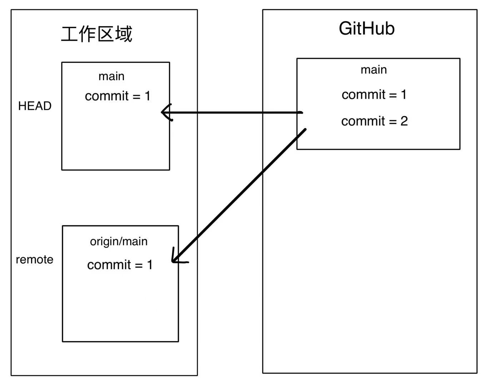
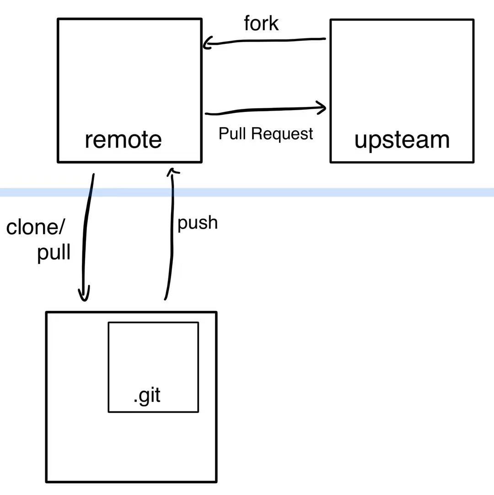

# Git 入门教程
> 在看本教程之前最好有一点编程的基础，如果学习能力超强的话，也可以不懂的地方立马去搜索学习。  

这是一个简要的中文 Git 教程(我会尽量避免说英文)，并不会讲述太过复杂的底层原理，仅仅用于入门，如果有错误的地方欢迎提出，想在某些位置加入更多的小 tips 也可以提出。  
> 想要更加深入的学习 Git 可以阅读 [Pro Git](https://git-scm.com/book/en/v2) 一书。  

1. 如果你从未听说过 Git，想要学习一下，读完这篇教程也是比较轻松的，遇见一些不了解的概念可以善用搜索引擎。  
2. 如果你接触过 Git，只复制运行过一些指令，想要了解 Git 是如何工作的可以直接跳转[这里](#git-是如何工作的)。  
3. 如果你只是想速成一下 Git，懒得看文字，可以直接跳转这个[快速上手](#快速上手-git)。  
4. 我在这里列一个比较简短的目录，你可以直接跳转到感兴趣的地方  
- [什么是 Git](#什么是-git)  
- [Git 是如何工作的](#git-是如何工作的)  
- [分支管理](#分支管理) 
- [安装 Git](#安装-git) 
- [快速上手 Git](#快速上手-git)
> 前面几个模块为纯理论，有关指令的部分都在快速上手板块中  
- [配置环境](#1-先配置下自己的-git-工作环境)
- [初始化](#2-进行初始化)
- [分支操作](#4-分支操作)
- [远程仓库](#6-远程仓库)
- [Git 命令查询](#其他一些命令选读)
5. 如果读完之后想请我喝杯奶茶，那我很感谢您(●'◡'●)请联系我。  


## 什么是 Git  
Git 是一种**分布式版本控制系统**，版本控制是一种记录一个或若干文件内容变化，以便将来查阅特定版本修订情况的系统。  

> 如果你的编程语言入门有一个好老师，那么一定知道代码版本管理的重要性。

> **引用自南京大学 git 入门教程——光玉**  
> 想象一下你正在玩 Flappy Bird, 你今晚的目标是拿到100分, 不然就不睡觉. 经过千辛万苦, 你拿到了99分, 就要看到成功的曙光的时候, 你竟然失手了！你悲痛欲绝, 滴血的心在呼喊着, "为什么上天要这样折磨我? 为什么不让我存档?"  
> 想象一下你正在写代码, 你今晚的目标是实现某一个新功能, 不然就不睡觉. 经过千辛万苦, 你终于把代码写好了, 保存并编译运行, 你看到调试信息一行一行地在终端上输出. 就要看到成功的曙光的时候, 竟然发生了段错误！你仔细思考, 发现你之前的构思有着致命的错误, 但之前正确运行的代码已经永远离你而去了. 你悲痛欲绝, 滴血的心在呼喊着, "为什么上天要这样折磨我?" 你绝望地倒在屏幕前... 这时, 你发现身边渐渐出现无数的光玉, 把你包围起来, 耀眼的光芒令你无法睁开眼睛... 等到你回过神来, 你发现屏幕上正是那份之前正确运行的代码！但在你的记忆中, 你确实经历过那悲痛欲绝的时刻... 这一切真是不可思议啊...  


## Git 是如何工作的  
Git有三个主要的工作区域：**[工作区](#工作区)**（working directory）、**[暂存区](#暂存区)**（staging area）和 **[版本库](#版本库)**（repository）。
> 相应的，被管理的文件就有以下这**几种状态**：
> - 未跟踪：新创建的文件最初是未跟踪的。它们存在于工作目录中，但没有被 Git 跟踪。
> - 已跟踪：将未跟踪的文件添加到暂存区后，文件变为已跟踪状态。
> - 已修改：对已跟踪的文件进行更改后，这些更改会显示为已修改状态，但这些更改还未添加到暂存区。
> - 已暂存：将修改过的文件添加到暂存区后，文件进入已暂存状态，等待提交。
> - 已提交：将暂存区的更改提交到本地仓库后，这些更改被记录下来，文件状态返回为已跟踪状态。



使用 Git 的基本工作流程如下：  
1. 在工作目录中修改某些文件。  
2. 对修改后的文件进行快照，然后保存到暂存区域。  
3. 提交更新，将保存在暂存区域的文件快照永久转储到 Git 目录中。  

> 快照是数据存储的某一时刻的状态记录  

> 这些 Git 操作是在你本地进行的，所有的内容也都保存在你的电脑里，完全可以离线进行这些操作。  

### 工作区
就是**本地**电脑文件系统上用于修改文件的**目录**，包含了当前项目的所有文件和子目录。  

### 暂存区
是一个中间状态，它充当了提交更改的缓冲区。所谓的暂存区域只不过是个简单的文件，一般存放在 .git 目录下的 index 文件中，所以有时我们也把暂存区叫作索引（index）。  
暂存区是一个**临时存储区域**，它包含了即将被提交到版本库中的文件快照，在提交之前，可以选择性地将工作区中的修改添加到暂存区。在 Git 中，必须明确地将文件添加到暂存区，然后才能将其提交到版本库中。这样做的好处是，可以对每个更改进行精细控制，并确保只提交需要保存的更改。  

### 版本库
包含Git存储库的所有**历史记录和元数据**。工作区有一个隐藏目录 .git，这个不算工作区，而是 Git 的版本库。它是 Git 存储库的核心组成部分，是由 Git 自动维护的。每次提交都会在版本库中创建一个新的快照，这些快照是不可变的。  
Git 并不保存前后变化的差异数据。实际上，Git 更像是把变化的文件作快照后，记录在一个微型的文件系统中。每次提交更新时，它会纵览一遍所有文件的指纹信息并对文件作一快照，然后保存一个指向这次快照的索引。为提高性能，若文件没有变化，Git 不会再次保存，而只对上次保存的快照作一链接  

> Git 使用 blob 类型的对象存储这些快照
> Blob 对象表示一个不可变、原始数据的类文件对象。

> 不用过于纠结指纹信息是什么，知道是可以唯一标识文件的信息即可。对计算机不太熟悉的话可以忽略后续校验和及看不懂的内容。  
> 实际上，在保存到 Git 之前，所有数据都要进行内容的校验和计算，并将此结果作为数据的唯一标识和索引。  
> Git 使用 SHA-1 算法计算数据的校验和，通过对文件的内容或目录的结构计算出一个 SHA-1 哈希值，作为指纹字符串。所有保存在 Git 数据库中的东西都是用此哈希值来作索引的，而不是靠文件名。  

### commit(提交)
进行提交操作时，Git 会**保存一个提交对象**（commit object）。该提交对象会包含一个指向暂存内容快照的指针，还包含了作者的姓名和邮箱、提交时输入的信息以及指向它的父对象的指针。首次提交产生的提交对象没有父对象，普通提交操作产生的提交对象有一个父对象，而由多个分支合并产生的提交对象有多个父对象。  
每次我们提交(代码到版本库)都会创建一个 commit 节点，我们一般将其可视化为下图所示，一个圆圈就代表一次提交，在圆圈中间写入 ID。每个提交对象都对应一个 commit ID，可以通过 ID 来回到指定的代码版本。  


> 这是一个[可视化学习 Git 的网站](https://learngitbranching.js.org/?locale=zh_CN)。  
> 你可以看完整篇文章再去玩，也可以现在就体验一下 git commit 是什么。这个游戏良好的引导，可能会有一些上瘾。一口气玩完也花费不了多少时间。    


## 分支管理
> 可以将分支理解为"平行世界"，创建新分支可以想象为生成前面与主分支一模一样，从此刻开始与原世界产生不一样变化的新世界。得到满意的结果之后把这次改变放到主分支(合并)。  

分支是 Git 中用于开发和管理代码的重要概念之一。Git 中的分支，其实本质上仅仅是个指向提交对象的**可变指针**，它在每次提交的时候都会**自动向前移动**。  
在 Git 中新建一个项目后，默认有一个分支，即主分支，有时我们也称主分支为主线。Git 的主分支并不是一个特殊分支，它跟其它分支完全没有区别。几乎每一个仓库都有，是因为 git init 命令默认创建它。  


> 如图，你可以形象的将 commit 节点的不同路径理解为分支。分支并不是一个难以理解的概念，在后续的接触中自然而然的就会理解了。  

实际上，前文也已经说过分支是指针，而非 commit 节点，请不要混淆，路径这一说法仅仅是帮助你理解。下图为两个分支，分别名为 master 和 testing，各自提交了一次代码的提交记录，图中的十六进制数字就是提交时生成的索引。  

每个分支都是一个独立的代码版本，可以在分支上进行修改和提交，而不影响主线上的开发工作。在分支开发完成之后，可以将分支合并到其他分支上，Git 会自动对比修改过的地方，并替换这些代码。  

> Git 分支是指向更改快照(提交对象)的指针。仅是包含所指对象校验和的文件，所以它的创建和销毁都异常高效。  

> **Git 又是怎么知道当前在哪一个分支上呢**  
> 也很简单，它有一个名为 HEAD 的特殊指针。在 Git 中，它是一个指针，用来表明当前所在的本地分支是哪个分支。HEAD 不仅可以指向分支还可以指向某一次提交记录。  

### 为何使用分支(选读)
主线和分支是两个独立的代码线，这样，你可以在一个分支上尝试新功能、修复bug或进行其他任何类型的开发，而不必担心破坏主线的稳定性。  
分支使得多个开发人员可以同时在不同的功能或修复上工作，而不会互相干扰。例如，一个团队成员可以在一个分支上开发新功能，另一个成员可以在另一个分支上修复bug。  

> **一个简单的分支与合并的例子**
> 开发某个网站。
> 为实现某个新的需求，创建一个分支。
> 在这个分支上开展工作。
> 假设此时，突然有个很严重的问题需要紧急修补，那么可以按照下面的方式处理：
> 返回到原先已经发布到生产服务器上的分支。
> 为这次紧急修补建立一个新分支，并在其中修复问题。
> 通过测试后，回到生产服务器所在的分支，将修补分支合并进来，然后再推送到生产服务器上。
> 切换到之前实现新需求的分支，继续工作。

你可以通过以下几种分支及其作用来理解这个概念：  
- **主分支**：主分支通常是最稳定的分支，用于发布生产版本。在 Git 中，主分支通常是 master 分支或者 main 分支。Github 在2020.10.1将仓库的默认分支从master更改为main。  
- **开发分支**：开发分支通常从主分支派生而来，在其上进行新功能或修复错误的开发。  
- **特性分支**：特性分支是为了开发单独的功能而创建的分支。这些分支通常从开发分支派生而来，并在实现目标后被合并回开发分支。  
- **发布分支**：发布分支是用于准备发布版本的分支，通常从主分支派生而来。这些分支应该包含与发布相关的所有更改，并且应该经过全面测试和审核后再合并回主分支。  
- **bug 分支**:用于修复代码中的错误或缺陷。当发现 bug 时，可以从当前开发分支创建一个 bug 分支，在该分支上进行错误修复。修复完成后，可以将更改提交到 bug 分支，并将其合并回开发分支和主分支。  

> 如果你是独立开发，那么你可以不使用分支，这完全依赖于你的习惯。  
> 但如果是团队开发，请尽量使用分支，养成良好习惯，避免主分支被污染，版本混乱。

### 冲突
存在两个分支各自都有新的提交，且都对同一段代码进行了修改，现在想将两个分支进行合并，Git 不知道使用哪一个版本。这时候，就需要人为来判断，或者写一版同时实现两种功能的代码。这就是所谓的冲突。  

> **开源小趣事**
> 我第一次接触冲突是在某一次开源贡献上，其他成员让我解决一下冲突，我那时还只是一个萌新，完全不知道冲突是什么东西，怎么解决。  
> 在网上一番搜索过后，发现冲突是实际上是个很难解决的东西，因为我当时根本看不懂其他大佬写的代码，也看不懂 Git 的提示，不知道谁的跟我产生了冲突> ^ <。  
> 后续就是全部交给其他大佬来解决了，让我产生了我真是一个弱鸡的感觉。  

在这里举一个例子：
小明和小红共同开发一个项目，这时候他们都收到了不同的需求，小明在分支一上面修改需求一，小红在分支二上面修改需求二。  
小红完成了修改，且在 `功能.md` 文件的第一行加入了这次修改的介绍，成功将提交合并到主分支上了。而小明不知道这件事，第二天小明检查完没问题之后，同样也在 `功能.md` 文件的第一行加入了自己修改的介绍。小明提交这次修改并且合并之后会发生什么？
分析一下，现在假设小红提交之后有两个文件，分别为`功能.md`和需求二文件。小明再合并自己的分支，他并不知道小红修改了`功能.md`，又由于是先后提交的，会认为第一次提交小红在第一行添加了内容，第二次提交小明修改了第一行的内容，所以将小红写的`功能.md`覆盖掉。  
然而！由于你使用了 Git 来管理代码，不会发生这种事。当小明提交了自己的修改，尝试合并到主分支。这时候，Git会拒绝他的要求并告诉他：你的本地版本太旧了，已经有新的修改了。  
这就是冲突。  

当合并过程中出现冲突时，Git 会标记冲突文件，你需要手动解决冲突。看到那些"<<<<<<<"和">>>>>>>"符号——不要慌张。这只是 Git 在告诉你：这里有多个人修改了，你需要看一下怎么处理。  
如何解决冲突，没有人能告诉你，只要做什么什么就可以了。这需要你自己看代码，分析，修改。一般情况下大家写的代码都没有问题，那么只需要将所有代码都保存写来即可。重新编辑产生冲突的文件，将两部分内容都放到文件中。  

在团队协作中，如果没有 Git 的保护，小红的记录被覆盖后可能永远找不回来。她可能花了一整天做的功能，在团队记录中就"消失"了。这不仅仅是记录的问题，下次如果有人要看这个功能是怎么实现的，或者为什么要这么做，就找不到依据了。当小红查看最新代码时，她会奇怪地发现自己的修改不见了。她可能会花很长时间去排查：是我没提交成功吗？还是代码被回退了？  

Git 的冲突机制，虽然看起来有点麻烦，但它实际上是在保护每一个人。它确保：
- 第一，你不会不小心覆盖别人的工作。
- 第二，你知道别人做了什么修改。
- 第三，最终的决策权在你手上，你可以决定怎么合并这些内容

我们要尽量避免冲突的产生：在开始工作前，先同步最新代码；在提交工作前，再同步一次最新代码。  

> 注意分支切换会改变你工作目录中的文件  


## Git 远程仓库(Github)
Git 并不像 SVN 那样有个中心服务器。  

> SVN 是集中式的版本控制架构，所有代码和版本信息都存储在中央服务器上。开发者需要从中央服务器获取代码并提交修改，需要依赖网络。  

Git 是一种分布式版本控制系统，客户端并不只提取最新版本的文件快照，而是把代码仓库完整地镜像下来。这么一来，任何一处协同工作用的服务器发生故障，事后都可以用任何一个镜像出来的本地仓库恢复。  
每个开发者都可以在本地完整复制整个代码仓库，包括所有历史记录和版本信息。这种架构允许开发者在本地进行提交、分支管理和合并操作，无需依赖中央服务器。Git 的分布式特性使其更适合分布式团队和并行开发。  
目前我们使用到的 Git 操作都是在本地执行，如果你想通过 Git 分享你的代码或者与其他开发人员合作。你就需要将数据放到一台其他开发人员能够连接的服务器上。通常使用 Github 作为远程仓库。  
通过远程仓库，开发者可以将本地的代码推送到 GitHub 上，供其他人查看和修改。  

> 在 Github 上，如果你想为某个仓库做贡献，那么请不要直接 clone 其他人的远程仓库，而是 fork 一个自己的远程仓库。先提交到自己的远程仓库，再向作者申请合入。私自就篡改其他人的代码会对其他开发者造成很大的麻烦，哪怕你是在优化代码，也请先在自己的仓库试验。  
> 后问有一个 fork 的粗略讲解，想看可以跳转[这里](#pull-request选读)

这与我们之前说过的 Git 的三个工作区域是完全错开的，Git 完全可以在不连接网络的情况下，纯在本地对代码版本进行管理。而远程仓库是另外一个板块，只有将本地的记录推送到远程仓库，远程仓库才会有你的记录。 
> git 中有两个操作分别为 `git pull` 和 `git push`,其中 git pull 的作用是获取远程仓库的内容，更新本地代码。git push 的作用是将我们更改的内容放到远程仓库，更新远程仓库。由于这两个单词直接翻译成中文为`拉`和`推`，所以我们以`拉取`和`推送`来表示这两种含义。  
> **我的小趣事**  
> 我之前并不知道这件事，所以有一次在大佬教学的时候，问出了：什么叫拉下来？  
> 大佬的原话是将这个仓库拉下来，意思就是从远程仓库下载到本地，结合语境当时并没有本地仓库，所以要使用 `git clone` 命令，就是拉下来。  



> 这部分内容不在此过多介绍，更多操作方面可以看后续[远程仓库](#6-远程仓库)部分

## 安装 Git  
- **从源码安装**：Git 的工作需要调用 curl，zlib，openssl，expat，libiconv 等库的代码，所以需要先安装这些依赖。之后，从 [Git 官方站点](http://git-scm.com/download)下载最新版本源代码，编译并安装。  

- **Windows**：[Git for Windows](https://git-scm.com/install/windows)  

- **Mac**：通过 [Homebrew](https://brew.sh) 安装，`brew install git`  

- **Debian系列**：`apt-get install git`  
- **Fedora上**：`yum install git-core`  

> 使用 Windows 操作系统请注意配置环境变量，确保 Git 可以被找到。  

### 常用 Git 命令
安装 Git 后，使用 `git` 命令可查看 git 携带的参数信息、常用的命令和解释。  
我在下面对这些常用命令进行翻译，你完全可以在命令行的输出中看到这些内容。  
|  命令  |               解释             |
| :---:  |            :---:              |
|  clone |      将仓库克隆到当前目录       |
|  init  |创建一个空仓库或者将仓库重新初始化|
|  add   |        将文件加入暂存区         |
|   mv   |       移动或者重命名文件        |
|   rm   |   删除工作区或者暂存区的文件     |
|  diff  |    显示两次提交之间的修改       |
|  log   |         显示提交日志           |
| status |        显示工作区状态          |

Git 的很多命令的作用都是里面英文单词的意思，或者是英文单词的缩写，一般很浅显易于理解，不懂英文的话不妨借助翻译软件看看。  
想了解 Git 的各式工具该怎么用，可以阅读它们的使用帮助。  
使用`git help <verb>`,\<verb>内容为具体命令，例如`git help config`。也可以使用 man 命令，如 `man git-log`。  

>在进行任何 Git 操作之前，都要先切换到 Git 仓库目录，也就是先要先切换到项目的文件夹目录下。  


## 快速上手 Git
> **了解如何打开命令行的话，可以跳过这段。**  
> 对于 Windows 用户或者**对命令行不熟悉的小伙伴**，在你的资源管理器找到一个合适的目录，单机鼠标右键，选择`在终端中打开`或者 `Open Git Bush Here`。  
> 之后你会看到一个可以输入文字的地方，尝试一下按任意按键，它会出现在你的屏幕上，输入某些特定的语句(命令)，控制台也会输出特定的语句。(可以将控制台理解为你刚刚打开的这个窗口)  
> 编辑好命令后，按下键盘上的`Enter`键确认(执行)。我后文给出的引用框中的即为命令语句，注意不要全部原封不动的粘贴，某些命令需要按照提示进行修改。  

> 初次接触可能会发生各种各样的情况，出现一片报红不要慌张，他只是说了一些英文而已。如果你不认识英文使用翻译软件看看，如果翻译出来发现还是看不懂，把它放到搜索引擎里试试，说不定会有解决办法。  

我先在这里总结一下，新手使用 Git 大致分为以下两种用途：  
1. 在本地管理自己的代码。  
2. 为远程仓库做贡献，或者备份自己的代码。 

这两种不同的用途在操作上可能会略有差异，但大致流程为以下几步(省流版)：  
1. 配置环境(仅需要一次)  
2. - 进行初始化：git init  
   - 拉取远程仓库：git clone \<url>  
3. 创建并切换分支：git checkout -b \<branchname>  
4. 提交代码到版本库：git commit -a  
5. 合并分支：git merge \<branchname>  
> 本地操作到这里基本就可以结束了，后续为远程仓库的操作。
6. 拉取远程仓库更新：git pull  
7. 推送代码到远程仓库：git push  


### 1. 先配置下自己的 Git 工作环境。  
- 设置提交人姓名和电子邮件地址，注意改为你自己的。  
`git config --global user.name "your name"`
`git config --global user.email "your email@xxx.com"`
- 配置默认的文本编辑器，该示例里使用的是 vim，修改为你自己喜欢的编辑器即可。  
`git config --global core.editor vim`
- 启用 Git 命令行输出的颜色显示。(可选)  
`git config --global color.ui true`
- 将 vimdiff 设置为默认的合并工具。(可选)  
`git config --global merge.tool vimdiff`

我只在这里列出了一些常用的，更多配置信息可以查看[官方文档](https://git-scm.com/docs/git-config)。  
注：仅需要配置一次信息，配好之后下次提交就可以不用配置了。  

> 要检查已有的配置信息，可以使用`git config --list`命令

### 2. 进行初始化
- 创建一个仓库，把这个目录变成 Git 可以管理的仓库。  
`git init`  

> 仓库的英文为 Repository ，有时用 Repo 代指仓库。你可以暂时将仓库理解为 Git 管理的三个区域，在仓库中进行的操作(执行 Git 命令)可以被 Git 管理。  

> 不一定必须在空目录下创建 Git 仓库，选择一个已经有东西的目录也是可以的。  

- 如果你想使用远程仓库中已有的代码库 (以 Github 为例)，在 Github 找到该代码库，找到并点击 fork 键，成功复制一份自己的远程仓库后，在自己的仓库中找到 Code ，点击后在本地里选择 HTTPS 复制下来，并将`https://github.com/XXX.git`部分进行替换。  
`git clone https://github.com/XXX.git`

> 如果你在中国且目前没办法科学上网，那么这一步可能会遇到 timeout 的问题。这时候不要慌，注意到 Code 中除了 HTTPS 还有其他选项，我们可以选择使用 SSH 进行连接。  
> 如果你之前没有配置过 SSH  
> - Windows 用户  
> 按下键盘上的 win 键，搜索 cmd 并打开。输入 `ssh-keygen -t rsa -C "your email@xxx.com"`，将 `your email@xxx.com` 改为你的电子邮件地址。之后一直按回车，直至命令行不再输出内容。  
> 打开"C:/User/yourname/.ssh/id_rsa.pub"，将 yourname 更改为你的计算机名称，复制该文件中内容。  
> 打开 Github 官网，登录账号，点击右上角头像 settings，选中左侧菜单栏的 SSH and GPG keys，点击 New SSH key，将内容的粘贴到 Key 文字框中，在 Title 文字框中命名，而后点击下面 Add SSH Key。  
> - Mac/Linux 用户  
> 打开终端，依次输入 `cd ~/.ssh` 和 `ls`，查看是否存在 id_rsa 和 id_rsa.pub文件，如果存在，说明已经有SSH Key。  
> 如果不存在ssh key，输入 `ssh-keygen -t rsa -C "your email@xxx.com"`，将 `your email@xxx.com` 改为你的电子邮件地址。  
> 接着输入 `cd ~/.ssh` 和 `cat id_rsa.pub`，复制输出内容。  
> 打开 Github 官网，登录账号，点击右上角头像 settings，选中左侧菜单栏的 SSH and GPG keys，点击 New SSH key，将内容的粘贴到 Key 文字框中，在 Title 文字框中命名，而后点击下面 Add SSH Key。  

> 可用此命令 `ssh -T git@github.com` 验证是否添加成功。  
> 如果失败可以尝试将 Github 添加到信任主机列表 `ssh-keyscan -t rsa github.com >> ~/.ssh/known_hosts`  

这个时候我们就有了可以管理的仓库了，工作区会产生一个 `.git` 的隐藏目录，就是所谓的版本库了。  

> 如何查看隐藏的项目：  
> - Windows: 资源管理器，查看，显示，勾选`隐藏的项目`  
> - Mac: 在 Finder 中，按下 Command + Shift + .（点）键  
> - Linux：使用`ls -a`  

### 3. 恭喜你！现在可以在工作区编写代码了！
> ***注意！***  
> 你如果是在为其他人的代码做贡献，请一定要新建一个分支，在自己的分支上提交代码。  
> 不要污染主分支！  

### 4. 分支操作
根据分支的作用(可以稍微回顾一下分支是用来做什么的)大致有以下几种操作：  

> Git 的分支非常轻量。它们只是简单地指向某个提交记录，仅此而已。所以许多 Git 爱好者传颂：  
> 早建分支！多用分支！  
> 这是因为即使创建再多的分支也不会造成储存或内存上的开销，并且按逻辑分解工作到不同的分支要比维护那些特别臃肿的分支简单多了。  

#### 查看分支
- 查看所有分支：  
`git branch`

> 也可以在 `.git/refs/` 中看到分支，heads 目录下的为本地分支，remotes 目录下的为远程分支。

#### 创建分支
- 新建一个名为 newbranch 的分支，将分支名称修改为恰当的名称，这里仅为示例无实际用途，所以命名为 newbranch。  
`git branch newbranch`

> 它只是为你创建了一个可以移动的新的指针。  
> 此时仅仅是创建的分支，我们的 head 指针指向的还是原本的分支，将 head 指向新分支(切换分支)后提交记录才会在新分支上。  

> newbranch 分支才刚刚创建，并未做任何提交或修改，所以里面的内容与主分支一样。  

#### 切换分支
- 现在切换到刚刚创建的新分支上：  
`git checkout newbranch`

> 可以使用一条指令同时完成分支的创建与切换：  
> `git checkout -b newbranch`

> 在 Git 2.23 版本中，引入了一个名为 git switch 的新命令，最终会取代 git checkout，因为 checkout 作为单个命令有点超载（它承载了很多独立的功能）。  
> 切换到指定分支：`git switch branch-name`
> 创建并切换到新分支：`git switch -c new-branch`
> 你可以在[官方文档](https://git-scm.com/docs/git-switch)里了解更多关于 switch 的信息。  

切换分支之后就可以在新分支上进行代码开发了。  
修改完代码之后需要将代码[提交到版本库](#5-将代码提交到版本库)，让 Git 记录这次提交，提交之后再进行后面的分支合并操作。

#### 合并分支  
将新分支合并到原本的主分支 main 上，常见的合并操作有两种，分别是 `merge` 和 `rebase`：
- 切换到 main 分支上。  
`git checkout main`  
将 newbranch 合并过来。  
`git merge newbranch`

- 切换到 newbranch 分支上。  
`git checkout newbranch`  
合并两个分支。  
`git rebase main`

虽然看起来两种操作只是顺序不一样，但是他们却完全不同。merge 操作可以更直观的看到每个分支的提交，rebase 则可以让你的提交记录变得更加线性。  

> merge 的中文翻译过来很直接就是合并。而 rebase 常常被翻译为变基，对于没接触过或者不了解英语的人，这个词可能比较难理解。  
> 我们将这个单词拆开看，re 的意思为重新，base 的意思为基础基准。**基**的理解很重要，理解了它，其实 rebase 命令你就掌握了。这里的基就是一个基点、起点的意思。`变基`就是改变当前分支的起点。注意，是当前分支！  
> 下面参照图片会比较好理解一些。  

注：1、2仅仅作为示意，实际中 commit ID 是一串十六进制数字。 

这里我们假设新分支是从主分支分出来的，我们在主分支 ID 为 2 的提交后创建新分支。那么新分支就是以主分支为"基"，2(commit ID)及以前的提交记录与主分支一样。如果说 merge 合并时是"向后看",那么 rebase 合并时是"向前看"。这里我将时间轴较早的时候称为`前`,较晚也就是后发生的时候称为`后`。  
`git merge newbranch` 将新分支"后"方合并到主分支，新分支最后一次提交后面没有其他东西了。由于不能覆盖主分支的提交记录，所以将两个分支最后一次提交拿出来，解决完冲突后，在主分支后面添加一个提交对象。  
`git rebase main`将主分支"前"方合并到新分支，但是主分支 ID 为 2 及之前的提交跟新分支一样，后面又更新了几次提交，所以要做的就是将这几次提交也放到新分支的提交之前（作为新分支的新"基"）。合并之后的新分支就与主分支在"同一路径"上，新分支比主分支提前的几次提交。rebase 就像是"把分支剪下来，接到另一个地方"  
如果主分支没有新提交，那么就还是用原来的基，rebase 操作相当于无效，此时和 git merge 就基本没区别了，差异只在于 git merge 会多一条记录 Merge 操作的提交记录。  
我的描述可能并不准确，只是为了能够帮助你理解。  

merge 的过程其实很好理解，就是对比两个分支的最新提交间不同的内容，将两者合并生成一个新的提交对象。  
  

当执行 rebase 操作时，Git 会从两个分支的共同祖先开始提取待变基分支（新分支）上的修改，然后将待变基分支指向基分支的最新提交，最后将刚才提取的修改应用到基分支的最新提交的后面。  
当在新分支上执行 git rebase main 时，Git 会从主分支和新分支的共同祖先开始提取新分支上的修改，也就是 4 和 5 两个提交。然后将新分支指向主分支的最新提交上，也就是 3。最后把提取的 4 和 5 接到 3 后面。还是由于不能覆盖先前的提交，会依次拿 3 和 4、5 的内容分别比较，处理冲突后生成新的 4' 和 5'。一定注意，这里新 4'、5' 和之前的 4、5 已经不一样了，是我们处理冲突后的新内容。  
  

也是由于 rebase 的抽象，可能过一段时间之后，你会对提交的记录感到疑惑，不明白为什么为了实现什么功能多加了某几次提交。所以我更习惯于使用 merge，可以更直观地查看分支间的关系。  
如果你不关注之前的提交记录，并且是独立开发，那么使用 rebase 确实可以确保提交历史更简洁。但合作开发的话，有一个缺点是，如果使用 rebase，那么其他开发人员想看主分支的历史，就不是原来的历史了，历史已经被你篡改了。  
这里引用[一个例子](https://blog.csdn.net/weixin_42310154/article/details/119004977)来解释，比如张三和李四从共同的节点拉出来开发，张三先开发完提交了两次然后 merge 上去了，李四后来开发完如果 rebase 上去（注意，李四需要切换到自己本地的主分支，假设先 pull 了张三的最新改动下来，然后执行`git rebase 李四的开发分支`，然后再 git push 到远端），则李四的新提交变成了张三的新提交的新基底，本来李四的提交是最新的，结果最新的提交显示反而是张三的，就乱套了，以后有问题就不好追溯了。  

> 如果合并过程遇到冲突，解决冲突完成后我们保存并关闭文件。
> 注意！此时我们仍然处于合并的"过程中"，要想完成合并必须告诉 Git：刚才冲突的文件就按照我刚才保存的这样解决！
> 怎么告诉 Git 呢？就是 `git add fileA.txt` 然后 `git commit -m "解决fileA文件的冲突问题"` 两个命令。说白了就是再把最新的 fileA.txt 文件加入 Git 的管理。
> 这些都做完之后，我们就已经渡过了合并过程了。
> 在合并分支时，我们像上面那样解决 fileA.txt 文件的冲突。这样 Git 就"知道了"上面这个冲突的解决办法，来替换冲突文件中的内容。那么如果此后再将将这两个分支合并时，我们就不必要再手动解决冲突了，因为 Git 已经知道该怎么做了。

#### 删除分支
- 对于已经合入其他分支，或者废弃的分支，我们可以删除该分支。  
`git branch -d newbranch`

> 强制删除未合并的分支，可以使用以下命令：  
> `git branch -D newbranch`

### 5. 将代码提交到版本库
在提交之前需要将代码先放到暂存区。  
- 将指定文件添加到暂存区，将 filename 改为你需要添加的文件名。  
`git add filename`
  如果你一次性修改了很多文件，不想一个一个打上去，可以使用：  
  `git add .`
- 将暂存区的代码添加到版本库，实际上就是提交操作，massage 为本次提交操作的注释，可以不携带 `-m` 参数，但是为了养成良好代码习惯不建议这样做。  
`git commit -m "message"`   

> 其实可以使用一条指令完成上述的两步操作，即  
> `git commit -a`
> 但是暂存区设立的意义就是让你确认一下，这样做有可能会有一些不需要的代码也在本次提交了。  

### 6. 远程仓库
> 如果你是为其他仓库做贡献，请不要慌张，这没有什么困难的，远程仓库与你的本地仓库也没有什么太大的区别。  

对于远程仓库，它本身也是一个仓库，有自己的分支、commit 记录等等。而你克隆过来，可以理解为复制了一份到你电脑的本地环境上，你的本地就有了它的代码、分支等等。  
对于自己的代码可以大胆一点，远程仓库可以不只有一个，可以在 Github 的服务器上放一份，在公司的服务器放一份，在自己的服务器上放一份等等等。  

> 你在本地进行的操作是对你自己仓库进行的，例如，远程仓库中有一个名为 branchone 的分支，你克隆过来本地也同样有了一个名为 branchone 的分支，这时候你输入切换分支的指令只会切换到本地的 branchone 分支上，是无法切换到远程的分支上的。  
> 那么现在有 yi 个问题，就是我们如何对远程仓库进行操作？ Git 是怎么确定远程仓库的？对于远程仓库都有哪些操作？...  

> 如果你是自己的代码想要放在 Github 上，那么需要先在 Github 上创建一个新的仓库才可以，就是 Github 上要先有一个远程仓库。  
> 或者先创建远程空仓库再克隆过来开发。  

现在重新总结一下(以为他人代码做贡献为例)，我们目前有三个仓库，分别是本地的仓库、自己的远程仓库、其他人的远程仓库。在还没进行提交时，这三个仓库是一模一样的；现在，我们已经对源码进行修改了，那么本地仓库就比其他两个仓库多了一个 commit 记录。我们想要将这个提交记录同步到远程仓库。  

#### 添加远程仓库
首先，我们要让本地仓库与远程仓库产生"关联"。
- 查看目前关联的远程仓库。  
`git remote -v`

> 尝试一下不携带 `-v` 参数会得到什么？

> 如果你是克隆过来的代码，那么你会看到已经有远程仓库了，这是 git clone 帮我们做的这件事。  

- 添加远程仓库，`origin` 为远程仓库的别名，后面的链接为 Github 给出的仓库地址，即克隆时使用的链接。  
`git remote add origin https://github.com/XXX.git`

> 为其他仓库做贡献的注意，虽然 git clone 帮你添加了远程仓库。但是我们仔细观察 `git remote -v` 的输出，发现这是自己 fork 得到的自己的远程仓库。我们还需要再将原本开发者的远程仓库也添加进来，这里找到原仓库的地址替换并执行 `git remote add upstream https://github.com/XXX.git`。 
> 由于有不只一个开发者在为这个代码库做贡献，所以我们需要将原始的仓库也添加过来，以便于及时获取代码库的更新。  

> remote、origin、upstream 的汉语分别是远端的、原始的、上游的。git remote 命令翻译过来就是关于远程仓库的命令。而 origin 和 upstream 都是我们给远程仓库起的别名，通常情况下我们只关联一个远程仓库就够了，所以开发者们大都习惯为这个最直接关联的远程仓库起名为 origin。但是如果在 Github 平台、Gitee 平台等都有远程仓库，那么将其分别命名也是有必要的。upstream 也是同理，为了获取代码我们将其命名为任意名字都不会有影响，只不过大家都习惯了这样命名，这个英文单词恰好有合适的含义罢了。  

> 但是 Git 的命令中有一些默认的操作就是使用 `origin` 和 `upstream`，有一些命令在未指定参数时默认使用这两个。所以在不熟悉命令时，请去官方文档中查看一下命令，否则可能出现一些未知的问题却不知道如何排查。  

添加完远程仓库，我们再使用 `git remote -v` 查看。会发现有两行一样的内容，一行后面写着 (fetch)，另一行写着 (push)。fetch 的意思是获取代码时使用该链接，对应的 push 就是推送代码时使用的链接。

我们已经添加了远程仓库，那么接下来对于远程仓库有两种操作，一是获取远程仓库的代码到本地，二是将本地的新代码放到远程仓库。  

#### 拉取(更新)远程仓库
- 将 origin 远程远程仓库中名为 main 的分支同步更新到本地分支 origin/main 中。  
`git fetch origin main`

> 更新所有分支可以使用 `git fetch -all`

- 合并 origin/main 分支到当前所在分支。与远程名没有直接的关系，需要指定的是被合并的分支。  
`git merge origin/main`

> 这里也可以使用 rebase，`git rebase origin/main`，具体使用哪个就看你的个人需求。  

为什么说*本地分支* origin/main 呢？  
origin 不就是我们给远程仓库起的别名吗，又为什么说*与远程名没有直接的关系*？  

实际上，我们本地的 .git 文件夹里面对应也存储了 git 本地仓库 main 分支的 commit ID，和跟踪的远程分支 orign/main 的 commit ID（可以有多个远程仓库）。  
进入 .git/refs 文件夹可以看到有三个文件夹，分别是 `heads`、`remotes`、`tags`。heads 是本地分支，remotes 里是追踪的远程分支，tags 是我们保存的某个版本。
main 和 origin/main 都是本地分支，不同的是 origin/main 指向远程仓库且无"实体"，相当于远程仓库 orign 的 main 分支在本地的一个副本。orign main 则很清晰，其中 origin 表示远程仓库名字，main 是远程仓库中的分支名字，是实实在在的服务器仓库中的分支。

> 当使用 git fetch origin main 时，本地的 origin/main 仓库会更新至最新，但是 main 分支无变化，此时再将最新代码合并至 main，main 也就是最新代码了

- 还有一种拉取代码的方式就是鼎鼎大名的 `pull`，它执行两个操作：从远程分支获取更改，然后将它们合并到当前分支。  
`git pull origin main`

如果不指定，git pull 默认使用 merge 来合并分支。但是也可以使用 `git pull --rebase` 来指定使用 rebase 进行合并操作。  

> 看到**其他人关于 pull 的小趣事**，这是[原文](https://blog.csdn.net/chuyouyinghe/article/details/141386568)：  
> 今天干活时，突然看到大群里有人艾特我，还甩了一张截图：  
> 
> 我很火大，群里艾特我膈应谁呢！  
> 我反驳到：我没用 merge，我用的 git pull 啊！  
> 同事立即回复：我知道，你用 rebase 啊！  
> 到这儿，我没敢再反驳了，因为我不太清楚 rebase 的意思，我开始怀疑是不是自己 git pull 用错了！用了快 5 年了，也不至于有大问题吧，我还是搜一下吧。  

> 但这并不代表这 rebase 就比 merge 更好！在生活中如果没有强制要求，更推荐使用 merge，尤其是与他人合作时。以下引用[一段文字](https://gitimmersion.com/lab_34.html)  
> 如果分支是公开的并且与他人共享，重写公开共享的分支往往会弄乱团队中的其他成员，尤其在提交分支的确切历史很重要时（因为重新变基会重写提交历史）。  
> 根据以上，我倾向于对生命周期短、仅在本地存在的分支使用 rebase，而对公共仓库中的分支使用 merge。

常常有人说，git pull 就等于 git fetch + git merge。在作用上他们的功能是大致相同的，都是起到了更新代码的作用。实际上却有一些细微的差别。  

当你执行 git fetch 命令时，Git 会联系远程仓库，下载那里的所有你还没有的数据。这些数据包括每个分支的最新提交，但不会更改你本地的工作状态。git fetch 命令会更新你的远程跟踪分支，这些分支对应于远程仓库中的分支。  

注：图片中的1、2仅仅作为示意，实际中 commit ID 是一串十六进制数字。  

> FETCH_HEAD，是 Git 中的一个特殊引用，用于记录最近一次从远程仓库抓取分支信息的状态。它是一个临时指针，指向最后一次 git fetch 操作获取的远程分支的最新提交。记录在本地的一个文件中，它指的是某个分支在远程仓库中的最新状态。
> 每次执行 git fetch 操作后 .git/FETCH_HEAD 文件会更新，其中记录了远程仓库中每个分支的最新提交信息。它允许开发者在合并代码之前，先了解远程仓库中的变化。

而执行 git pull 命令时，会同步更新本地的状态和追踪的远程分支，这看起来与先更新再合并实现的效果一样。  


更推荐大家使用 git fetch 而不是 git pull，下面引用一段文字说明(文字来源未知，如果能找到文献请联系我，我将其加入引用)
> git pull 的问题是它把过程的细节都隐藏了起来，以至于你不用去了解 Git 中各种类型分支的区别和使用方法，这也让开发者更加便利。  
> 当然，多数时候这是没问题的，但一旦代码有问题，你很难找到出错的地方，看起来 git pull 的用法会使你吃惊。  
> 将下载(fetch)和合并(merge)放到一个命令里的另外一个弊端是，你的本地工作目录在未经确认的情况下就会被远程分支更新。  
> 当然，除非你关闭所有的安全选项，否则 git pull 在你本地工作目录还不至于造成不可挽回的损失，但很多时候我们宁愿做的慢一些，也不愿意返工重来。  


#### 推送远程仓库
- 最后一步，将更改的代码同步到远程仓库即可，origin 为远程仓库名，main 为要推送的分支。
`git push origin main`

push命令有两种方式，分别为：
- matching（匹配所有分支）
matching 参数是 Git 1.x 的默认参数，也就是老的执行方式。其意是如果你执行 git push 但没有指定分支，它将 push 所有你本地的分支到远程仓库中对应匹配的分支。
- simple（匹配单个分支）
simple 参数是 Git 2.x 默认参数，意思是执行 git push 没有指定分支时，只有当前分支会被 push 到远程仓库。

如果想使用matching方式，可以在命令行输入：  
`git config --global push.default matching`  
如果想使用simple方式，可以在命令行输入：  
`git config --global push.default simple`  

> 这一步几乎不会遇到问题，如果你的本地仓库副本与你正在推送到的上游仓库不同步或"落后"，你将收到一条消息，提示`非快进更新被拒绝`。这意味着你必须在能够推送本地更改之前检索或"获取"上游更改。  
> 如果在你 pull 结束后 push 开始前，并且你的网络很差劲，这时候恰好有其他人成功推送了代码，那你的版本就会落后与远程仓库。虽然这个概率极小，但是 Git 会提示你的，不要担心。

#### Pull Request(选读)
经常听到有人在群里喊："大佬，帮我合个 PR"，"大佬，我刚提交了一个 MR，帮忙合一下，急着出补丁"。PR 和 MR 都是什么，到底有什么区别。  
PR 和 MR 都是远端服务器上的操作，与我们之前提交的本地代码管理功能是两个模块。下图蓝线以上的是服务器端，以下为本地。  


> 简单介绍一下 fork。  
> fork 是一个版本库的粗略拷贝。fork 的中文为分叉、叉子，看中文可能有点难理解，你可以音译为复刻来理解。要知道在服务器端我们没有其他仓库的权限，你只有自己账号下的推送、合并等权限。  
> fork 版本库允许你在不影响原项目的情况下自由地测试和调试修改。fork 不是 Git 的功能，它是 GitHub 等 Git 服务的一个特点。fork 完成后，版本库的副本将被复制到你的 GitHub 账户。它不会影响原始仓库。我们可以自由地进行修改，然后为主项目创建一个拉动请求。项目的所有者会看到你的建议，并决定是否要合并这些修改。  
> fork 与 clone 这两个命令有些类似都是用来创建一个版本库的副本。区别是，fork 用来创建服务器端的拷贝，而 clone 用来创建版本库的本地拷贝。一般来说，在同一个项目上工作的人 clone 版本库，而外部贡献者则 fork 版本库。因为无法保证其他人会对代码做哪些不可控的修改，所以其他人是没有权限的。  
> fork 仓库没有特定的命令。它是由 GitHub 等第三方 Git 服务提供的一项服务。git clone 则是一个命令行工具，用来创建项目的本地拷贝。在"Fork + Pull"模式下，仓库参与者不必向仓库创建者申请提交权限。  
> 进入 github 项目主页后，可以看到右上角有 Fork 按钮，点击之后，等待几秒就会 fork 成功。  

看上图 pull request 实现的目的，拉请求？这明明是推啊，将自己的修改推到原作者的仓库，感觉叫"push request"比较合适吧。  
在 Git 中，PR 是一种请求，由代码贡献者发起，目的是请求项目维护者拉取（pull）自己的代码变更。这是一个协作过程，涉及代码审查（Code Review）和讨论，最终决定是否将变更合并到项目中。  
从 0 到提交 Pull Request 的基本工作流程：  
1. fork 原仓库到个人账户，这样就拥有了原项目的一个独立副本。  
2. 将 fork 后的仓库 clone 到本地。  
3. 在本地创建新分支，进行代码修改。  
4. 将修改后的代码 commit 并 push 到个人仓库的新分支。  
5. 在 GitHub 上对应的分支上发起 PR，请求原仓库维护者审查代码。维护者审查代码后，决定是否接受PR并合并到项目中。  

所以 PR 其实就是向原作者"发消息"通知他，我这里有一个修改，你来看看怎么样？可以的话就采纳我的代码吧！PR 是在服务器端的操作，所以要到 Github 上你自己账号下的仓库，如果有 push 的记录那么会提示你创建一个 Pull Request。  
这里引用一段[其他人的经验](https://zhuanlan.zhihu.com/p/672447698)  
1. 注意点礼貌问题。提交 pull request 不是写邮件，没必要那么正式，但跟作者对话要尊重一点，写 comment 的时候，有格式尽量按人家格式填。一大好处就是可以享受到新手保护期，让人家知道你虽然不会用 git，至少还是个人，不是个 P 都不懂的牛吗。  
2. 能先提出 issue 的话，先写一个 issue，说明一下有某某问题，我觉得可以如何做之类，看作者的回复。说不定作者已经在改进这里，而其他人给的方案通常是不如作者的。  

> 在 github 上提交了一个 pull request，在作者进行操作前，发现自己某处错了，需要进行修改怎么办？  
> 其实很简单，其他人拉取的是你服务器端的远程仓库，只要你及时将修改提交(push)过去，那么原作者看到(拉取)的就是你修改之后的代码了。  


#### Merge Request(选读)
Merge Request 的中文翻译为合并请求。这一部分引用[一个简单的例子](https://blog.csdn.net/xiaoxuantengkong/article/details/45345867?spm=1001.2014.3001.5502)来说明：  

你们公司的服务器是 Stash，上面有个正在开发的项目：ComRepository。这个项目有三个分支：master，worker1，worker2。那么如果把这个项目 clone 下来之后，本地也会有三个分支：master, worker1, worker2。现在有6个实实在在的分支，服务器上 3 个，你本地 3 个。  
而对于公司来说，他们不在乎每个员工本地的分支是怎样，他们只在乎服务器上的 master 分支是否运转正常。因为服务器上的 master 分支有可能就是公司发表项目时用的分支，所以这个分支上的代码至关重要！  
此时公司要求你就在 worker1 分支上开发。那么你的开发流程是什么呢？如何让服务器上的 master 分支有你开发好的代码？  

> 为了方便，后面把本地分支带上后缀（L），如 worker1（L）。

一种思路：  
在 worker1(L)分支上开发，然后切换到 master(L)上，将worker1(L)分支合并到 master(L)上来，然后将 master(L)的新代码推送到服务器的 master 上去。  

> 这种思路是不该推荐的，如果我是老大，我是不会给你分配 master 分支的 push 权限的。因为这样太危险了，master 分支是公司至关重要的分支，岂能让你说 push 就 push？这样会让公司的 master 上的代码时刻处于危险之中。

第二种思路：  
就是 Merge Request 的思路。我们每个开发人员都没有 master 分支的 push 权限，但是有 pull 权限。即只能看，不能写。但是我们有其它分支（如 worker1 和 worker2）的 pull 和 push 权限，反正这两个分支也不是太重要的分支，开发者爱怎么糟蹋怎么糟蹋。  
那么怎么才能让服务器上的 master 分支得到更新呢？就是在服务器上进行**合并**动作，即将服务器上的 worker1 或者 worker2 分支上的内容 merge 到 master 分支上。这个过程就是Merge Request！  
所以服务器上的合并操作不是靠你本地 git merge 命令来完成的，因为你只能操作你本地的分支，服务器上的分支你八竿子打不着，怎么可能轻易去"命令它"？所以这个合并动作基本上是在你们服务器的网页上进行的。比如：你在公司服务器的网站上，发起一个 Merge Request，请求把服务器上的 worker1 分支合并到master分支上去，请求发起要添加一些审核人物，譬如你的老板你的同事。当他们接收到这个 Merge Request 并同意后，可能会有个"同意"之类的按钮，点击之后就会在服务器上把 worker1 分支合并到 master 中。这样做就有效地保护了 master 分支的安全性。
> 简单来说就是在本地修改其他分支，推送其他分支到远程仓库，将其他分支与主分支的合并过程放在服务器（远程仓库）上进行。  

试想一下：如果你请求 worker1 往 master 上合并，我请求 worker2 也往 master 上合并。那么久而久之，我们有可能都改了同一个文件，就可能会产生冲突。那样的话 master 分支上岂不是乱七八糟了？那么怎么才能让 master 上的分支一直正确，不产生冲突呢？

比如你是在 worker1(L)分支上的开发者，做完了一天的工作。先不要提 Merge Request，而是先切换到 master(L)上，拉取一下最新代码，把服务器上 master 的代码拉下来，确保本地的 master(L)是最新的 master 代码。  
然后切换回 worker1(L)分支，将 master(L)分支 merge 到 worker1(L)上，这时候就有可能发生冲突了，因为可能在你下班之前，worker2 分支的同事已经提交了代码并且更新了 master，而你们恰巧修改了同一个文件。  
这时候冲突了不要紧，因为冲突是发生在你本地的，你只要在本地把冲突解决了，然后 push 到 worker1 分支上去，再提 Merge Request，就不会使服务器上的 master 产生代码冲突了。  

> Pull Request 和 Merge Request 本质上都是合入代码，只是站在不同角度有不同的说法而已，因此在学习和工作中用哪一个都没有问题。但是由于实际中没有推送权限，可能 PR 用的相对较多。  

### 其他一些命令(选读)
如果你不想读此部分内容，可以直接跳转到下一部分[小技巧](#一些其他小技巧)或者阅读到此结束。  
我将 [Git 备忘录](https://git-scm.cn/cheat-sheet.pdf)中的内容放到这里，用于快速查询，但这不是全部指令，在官方文档中查阅[全部指令](https://git-scm.cn/docs/git#_git_commands)

初始化新仓库：git init  
克隆现有仓库：git clone \<url>  
**准备提交**  
添加未跟踪文件或未暂存的变更：git add <文件>  
添加所有未跟踪文件和未暂存的变更：git add .  
选择要暂存的文件部分：git add -p  
移动文件：git mv <旧名称> <新名称>  
删除文件：git rm <文件>  
让 Git 忽略文件而不删除它：git rm --cached <文件>  
取消暂存一个文件：git reset <文件>  
取消暂存所有内容：git reset  
查看你已暂存的内容：git status  
**进行提交**  
进行提交（并打开文本编辑器编写提交信息）：git commit  
进行提交：git commit -m '提交信息'  
提交所有未暂存的变更：git commit -am '提交信息'  
**在分支间切换**  
切换分支：git switch <分支名> 或 git checkout <分支名>  
创建分支：git switch -c <分支名> 或 git checkout -b <分支名>  
列出分支：git branch  
按最近提交时间列出分支：git branch --sort=-committerdate  
删除分支：git branch -d <分支名>  
强制删除分支：git branch -D <分支名>  
**查看暂存/未暂存的变更**  
查看所有暂存和未暂存的变更：git diff HEAD  
只查看暂存的变更：git diff --staged  
只查看未暂存的变更：git diff  
**查看提交记录的变更**  
显示一个提交与其父提交的差异：git show <提交记录>  
比较两个提交记录的差异：git diff <提交记录> <提交记录>  
比较一个文件自某个提交记录以来的差异：git diff <提交记录> <文件>  
显示差异的摘要：git diff <提交记录> --stat 或 git show <提交记录> --stat  
**放弃你的变更**  
放弃单个文件的未暂存变更：git restore <文件> 或 git checkout <文件>  
放弃单个文件的所有暂存和未暂存变更：git restore --staged --worktree <文件> 或 git checkout HEAD <文件>  
放弃所有暂存和未暂存的变更：git reset --hard  
删除未跟踪文件：git clean  
'暂存' 所有暂存和未暂存的变更：git stash  
**编辑历史**
"撤销" 最近一次提交（保持工作目录不变）：git reset HEAD^  
将最近 5 次提交合并成一次：git rebase -i HEAD~6 然后将要合并到前一个提交的提交记录前的 "pick" 改为 "fixup"  
**撤销一次失败的 rebase**  
git reflog <分支名>  
然后手动在 reflog 中找到正确的提交 ID，再运行 git reset --hard <提交记录>  
修改提交信息（或添加遗漏的文件）git commit --amend  
**代码考古**  
查看分支的历史记录：git log main 或 git log --graph main 或 git log --oneline  
显示修改了某个文件的所有提交记录：git log <文件>  
显示修改了某个文件的所有提交记录，包括它重命名之前的记录：git log --follow <文件>  
查找添加或删除了某些文本的所有提交记录：git log -G branchname  
显示最后修改了文件中某一行的人：git blame <文件>  
**合并分叉的分支**  
- 使用 rebase 合并  
git switch banana  
git rebase main  
- 使用 merge 合并  
git switch main  
git merge banana  
- 使用 squash merge 合并  
git switch main  
git merge --squash banana  
git commit  
- 将一个分支更新到与另一个分支同步（也称为 "快进合并"）  
git switch main  
git merge banana  

将一个提交记录复制到当前分支：git cherry-pick <提交记录>  
**恢复旧文件**  
获取另一个提交记录中某个文件的版本：git checkout <提交记录> <文件> 或 git restore <文件> --source <提交记录>  
**添加远程仓库**
git remote add <名称> \<URL>  
**推送你的变更**  
将 main 分支推送到远程 origin：git push origin main  
将当前分支推送到其远程 "跟踪分支"：git push  
推送一个你从未推送过的分支：git push -u origin <分支名>  
强制推送：git push --force-with-lease  
推送标签：git push --tags  
**拉取变更**  
获取变更（但不修改你任何本地分支）：git fetch origin main  
获取变更然后 rebase 当前分支：git pull --rebase  
获取变更然后将它们合并到当前分支：git pull origin main 或 git pull  
**配置 Git**  
设置一个配置选项：git config user.name '你的名字'  
全局设置选项：git config --global ...  
添加一个别名：git config alias.st status  
查看所有可用的配置选项：man git-config  
**重要文件**  
本地 git 配置：.git/config  
全局 git 配置：~/.gitconfig  
要忽略的文件列表：.gitignore  


## 一些其他小技巧
该部分为上文的补充以及我遇到的一些困难，并非是高级操作之类的，只是为了实现某些特定目的。  
> 想继续深入学习可以参考以下链接：  
> [Git 官方教程](https://git-scm.cn/docs/gittutorial-2)  
> [Git 用户手册](https://git-scm.com/docs/user-manual)   
> [Git 核心教程](https://git-scm.com/docs/user-manual)  

### gitignore
一般我们总会有些文件无需纳入 Git 的管理，也不希望它们总出现在未跟踪文件列表。通常都是些自动生成的文件，比如日志文件，或者编译过程中创建的临时文件等。我们可以创建一个名为 .gitignore 的文件，列出要忽略的文件模式
```
$> cat .gitignore
*.[oa]
*~
```
文件 .gitignore 的格式规范如下：
- 所有空行或者以注释符号 ＃ 开头的行都会被 Git 忽略。
- 可以使用标准的 glob 模式匹配。
- 匹配模式最后跟反斜杠（/）说明要忽略的是目录。
- 要忽略指定模式以外的文件或目录，可以在模式前加上惊叹号（!）取反。

> 所谓的 glob 模式是指 shell 所使用的简化了的正则表达式。

### 回溯到指定版本与 Tag
回溯到某个指定版本，可以说是 Git 的核心功能之一，也就是实现开头[光玉](#什么是-git)小故事中的功能。  
有两种方法实现此功能，分别为 revert 和 reset，在回溯之前我们要先知道如何查看提交记录。
> revert 的中文为恢复，reset 的中文为重置。  

- 查看提交时的 commit ID ，通过 ID 我们就可以找到这次提交。  
`git log`
- revert 的作用是撤销某次提交，将指定提交的内容从当前分支上撤除。创建一个新的提交来反向修改指定的提交内容，从而达到撤销的效果。  
`git revert <commit-ID>`
> 如果需要撤销多个连续的提交，可以使用范围撤销：
> `git revert <OLDER_COMMITID>^…<NEWER_COMMITID>`

- reset 的作用是修改 HEAD 的位置，即将 HEAD 指向的位置改变为之前存在的某个版本，且该版本之后的提交记录将全部消失。  
`git reset --hard <commit-ID>`
> 可以修改 `hard` 为其他参数来实现将后面修改的代码放到暂存区等，请自行查阅[官方文档](https://git-scm.com/docs/git-reset)。

为了方便回溯到特定的版本，我们可以给该版本打上一个标签。标签是一个有意义的名称，可以代表整个版本或者某个重要的里程碑。  
- 给当前版本打上一个标签：  
`git tag <tag-name>`  

当然，我们也可以给之前的某个版本打标签，只需要指定对应的提交ID即可。  
一旦我们给某个版本打上了标签，就可以随时回溯到该版本。  
- 切换到标签所对应的版本：  
`git checkout <tag-name>`  

切换版本后，我们就回到了该版本的代码状态，可以查看代码、运行测试等。如果需要在该版本上进行代码修改，可以创建一个新的分支。  

### git stash
使用 Git 的时候，我们往往使用分支解决任务切换问题，例如，我们往往会建一个自己的分支去修改和调试代码, 如果别人或者自己发现原有的分支上有个不得不修改的 bug，我们往往会把完成一半的代码提交到本地仓库，然后切换分支去修改 bug，改好之后再切换回来。
这样的话往往 log 上会有大量不必要的记录。其实如果我们不想提交完成一半或者不完善的代码，但是却不得不去修改一个紧急 Bug，那么使用 git stash 就可以将你当前未提交到本地（和服务器）的代码推入到 Git 的栈中，这时候你的工作区间和上一次提交的内容是完全一样的，所以你可以放心的修 Bug，等到修完 Bug，提交到服务器上后，再使用 git stash apply 将以前一半的工作应用回来。
还有一种情况，在写代码时发现有一个类是多余的，想删掉它又担心以后需要查看它的代码，想保存它但又不想增加一个脏的提交。这时就可以考虑 git stash。
> stash 的中文为储藏，也很好理解

- 临时保存未提交的更改
`git stash save "message"`
可以获取你工作目录的中间状态，也就是你修改过的被追踪的文件和暂存的变更，并将它保存到一个未完结变更的堆栈中，随时可以重新应用。
可以通过命令
- 恢复之前缓存的工作目录
`git stash pop`
这个指令将缓存堆栈中的第一个stash删除，并将对应修改应用到当前的工作目录下。

<!-- 
TODO：
遇到冲突怎么办？
不知道发生了什么怎么办？
如何全部推倒重来？ 
-->

## 写在最后
恭喜你！现在已经成功入门 Git 了，在生活中使用这个工具吧。  
Git 中这么多指令不是靠背下来的，是靠查手册查会的。没有人能记住所有的指令，每次一遍遍搜索，一遍遍敲击，慢慢的就记住了，忘记了也可以再看一遍手册。  
这个教程也不是希望你全部都倒背如流，只是在你看过一遍之后，大致了解有这么一个功能。  
人没办法想象自己没见过的东西，你在知道大概可以这样做之后，就简单多了，在互联网上有很多人愿意分享。  
我很希望在我入门的时候有一个教程能手把手的教我，但是被动输入的效果远远比不上你发自内心的想去了解。想学习相关知识的话，网络上有无数个教程比我写的好。  
我原本并没有打算写这么长的教程，但是写着写着就什么都想提及一下，就像教当初什么也不会的自己一样。我担心新手会不会不知道我说的话是什么意思，就像分支，我接触之后很快就理解这是什么了，但我想在没办法站在什么都不懂的人的角度，我不知道你能不能理解，我只能尽可能详细地去描述它是用来做什么的。  
关于为什么写这个教程，一部分是我想写给那个什么当初都不懂的自己，一部分我想再回顾一下 Git 的相关知识，写教程也能让我更加的了解 Git。  
很多好的教程都是英文书写的，因为这是当下最流行的语言。相信有不少老师说过搜索英文关键词会比搜索中文更好，能更加简单的获取更多的有用信息，但英语对于一些国内刚入门的学生来说也是门槛。  
如果这篇教程能帮到你，那我很开心！  
你想立马尝试一下的话请 clone 此仓库，然后创建一个新文件提交一个 pr 给我，你可以在文件里写自己成功了很高兴这是我的第一个 pr，或者遇到什么困难了，分享解决经验之类的，我会很乐意与你讨论。  
如果发现什么差错的话可以提交 pr 修改，非常感谢你的指正。  